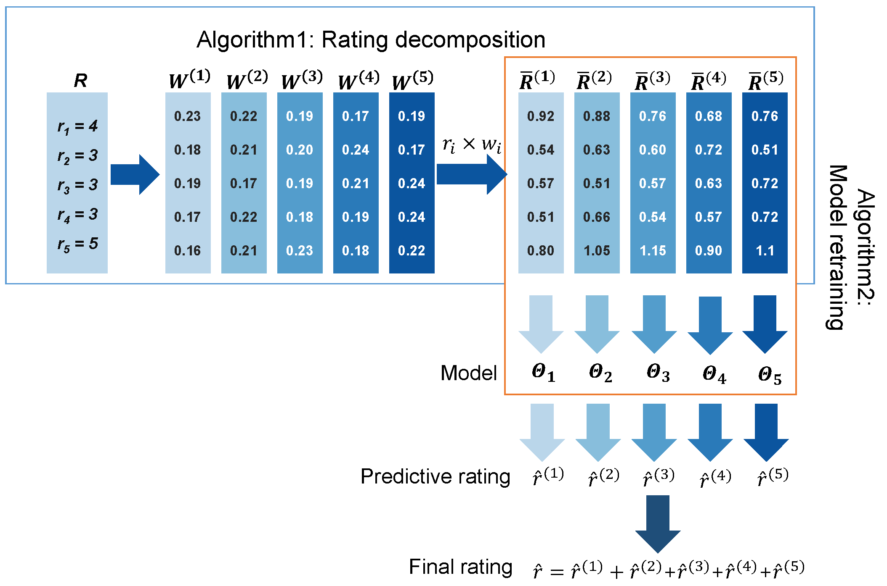

In order to model user-item interactions, we design a hybrid neural network where the MLP is used to build the global network and the residual network is applied to form the local neural blocks. Two top-n accuracy metrics are selected to measure the performance of algorithms since the accuracy of top-n item recommendation are the main concern for users in the real world applications.
<!--  -->

[Download paper here](http://fange.pro/files/2021Collaborative.pdf)
